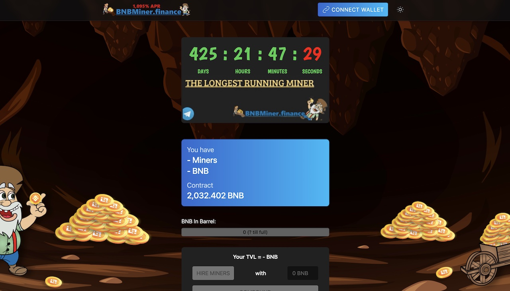
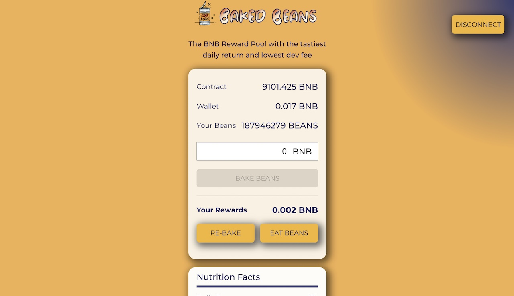
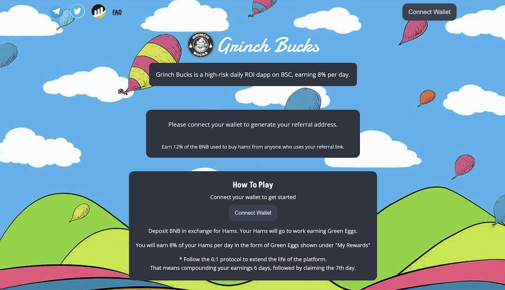
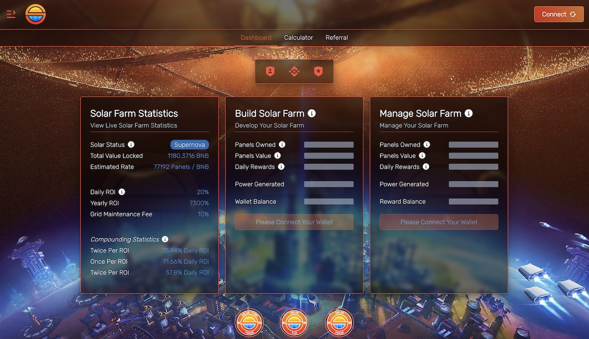

# Autominer Web3 Project Automation Script
>BNB Miner Web3 automation script. Supports Baked Beans Miner, Grinch Bucks Miner, BNB Miner, Roast Beef, and soon several others!

The purpose of the script is to automate the typical actions required by "miner" types of crypto projects. The script checks each project once an hour and performs either a compound (reinvestment) or withdrawl action based on schedule settings contained within [projectname_module.py]. 

>The main goal of writing this script was to remove the need to keep checking on these projects daily!

Currently, the script has the following features:

1. Performs all actions directly to the project's contract (on chain) using native python Web3 libraries.
2. Supports an easy-to-modify framework for adding new projects using similar contracts.
3. Saves historical data for both debugging and typical recordkeeping. 

## Supported Projects
<table>
<tr>
<td>
    <a href="https://bnbminer.finance?ref=0x83F85b7f200718C1E52798f90d2fBAEfd49A6671">
        <b>BNB Miner</b>
        
    </a>
</td>
<td>
    <a href="https://bakedbeans.io?ref=0x83F85b7f200718C1E52798f90d2fBAEfd49A6671">
        <b>Baked Beans Miner</b>
        
</a>
</td>
</tr>
<tr>
<td>
    <a href="https://grinchbucks.com/?refer=0x83F85b7f200718C1E52798f90d2fBAEfd49A6671">
        <b>Grinch Bucks Miner</b>
        
    </a>
</td>
<td>
    <a href="https://roastedbeef.io/#/?ref=0x83f85b7f200718c1e52798f90d2fbaefd49a6671">
        <b>Roast Beef Miner</b>
        
    </a>
</td>
</tr>
<tr>
<td>
    <a href="app.solarfarm.finance/?ref=0x83F85b7f200718C1E52798f90d2fBAEfd49A6671">
        <b>Solar Farm Miner</b>
        
    </a>
</td>
<td>
</td>
</tr>
</table>

## Installation
Installation is simple, just install the dependencies in your favorite Python environment, setup your wallet addresses, and run!

```
pip install -r requirements.txt
```

## Usage
This script is run at the command line and does not feature any type of graphical interface. 

### Step One - Configure your wallet addresses!

Your public wallet address and private key need to be added before the script will work. Please follow security best practices when using your private key!

Edit the following variables within <a href="autominer.py">autominer.py</a>.

```python
myWalletAddress = ""
myPrivateKey = ""
```
><i>NOTE: I HIGHLY recommend that you only set the above variables immediately before running the script, clearing them(and saving) once the script is running to avoid storing your wallet's private key on disk.</i>

### Step Two - Run the script!

```
python autominer.py
```

## Enjoy!
If you like this script, and you want to see more of these types of Web3 automation scripts, please support me by using the above project referral links! You can also check out my other work on my <a href="https://www.rittmuller.com">web site</a>.

## LICENSE
This project is distributed under the <a href="LICENSE">MIT</a> license. 
